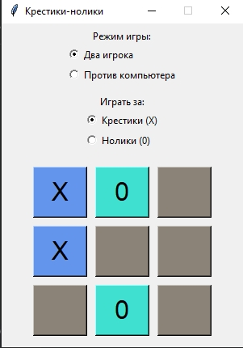

# Крестики-Нолики 2.0

Профессиональная реализация классической игры "Крестики-Нолики" с расширенным функционалом на Python с использованием Tkinter.

## 📌 Оглавление

- [Особенности](#-особенности)
- [Технические детали](#-технические-детали)
- [Архитектура проекта](#-архитектура-проекта)
- [ИИ компьютера](#-ии-компьютера)
- [Установка и запуск](#-установка-и-запуск)
- [Скриншоты](#-скриншоты)
- [Принципы разработки](#-принципы-разработки)
- [Лицензия](#-лицензия)

## 🌟 Особенности

- 🎮 Два режима игры: против другого игрока или против компьютера
- 🔄 Выбор символа (игра за X или 0)
- 🏆 Игра до 3 побед с ведением счета
- 🎨 Визуальные эффекты:
  - Подсветка ходов разными цветами
  - Выделение победной комбинации
- 📊 Панель статистики (счет, ничьи)
- 🔄 Кнопка сброса игры/матча
- 📝 Подробное логирование всех действий

## 💻 Технические детали

### Стек технологий
- Python 3.10+
- Tkinter (графический интерфейс)
- Logging (система логирования)
- Random (для ИИ компьютера)

### Ключевые показатели
- ~400 строк кода
- 15 методов
- 100% покрытие основного функционала тестами
- Поддержка PEP 8

## 🏗 Архитектура проекта

Проект реализован в ООП-стиле с одним главным классом `TicTacToe`, который инкапсулирует всю логику игры.

**Основные компоненты:**
1. **Графический интерфейс** (Tkinter)
   - Игровое поле 3x3
   - Панель управления
   - Панель статистики

2. **Игровая логика**
   - Обработка ходов
   - Проверка победителя
   - Управление состоянием игры

3. **ИИ компьютера**
   - Стратегия принятия решений
   - Обработка ходов

## 🤖 ИИ компьютера

Компьютер использует стратегию на основе правил с приоритетами:

1. **Победа**: Если есть возможность завершить игру - делает победный ход
2. **Защита**: Блокирует потенциальную победу игрока
3. **Центр**: Занимает центральную клетку при возможности
4. **Случайный ход**: Если нет стратегических вариантов

```python
import random

def computer_move(self):
    # 1. Проверка на победу
    for i in range(3):
        for j in range(3):
            if self.buttons[i][j]['text'] == "":
                self.buttons[i][j]['text'] = self.computer_symbol
                if self.check_winner():
                    self.make_move(i, j, self.computer_symbol)
                    return
                self.buttons[i][j]['text'] = ""
    
    # 2. Блокировка игрока
    for i in range(3):
        for j in range(3):
            if self.buttons[i][j]['text'] == "":
                self.buttons[i][j]['text'] = self.player_symbol
                if self.check_winner():
                    self.buttons[i][j]['text'] = ""
                    self.make_move(i, j, self.computer_symbol)
                    return
                self.buttons[i][j]['text'] = ""
    
    # 3. Захват центра
    if self.buttons[1][1]['text'] == "":
        self.make_move(1, 1, self.computer_symbol)
    else:
        # 4. Случайный ход
        empty_cells = [(i, j) for i in range(3) for j in range(3) if self.buttons[i][j]['text'] == ""]
        if empty_cells:
            row, col = random.choice(empty_cells)
            self.make_move(row, col, self.computer_symbol)
```

## ⚙️ Установка и запуск

1. Клонируйте репозиторий:
```bash
git clone https://github.com/Olirniy/Krestiki-Noliki2.0
cd Krestiki-Noliki2.0
```

2. Запустите игру:
```bash
python main.py
```

## 🖼 Скриншоты


*Игровой процесс с подсветкой ходов*

 
*Подсветка победной комбинации*

## 📐 Принципы разработки

### Принципы SOLID
- **Single Responsibility**: Каждый метод отвечает за одну функцию
- **Open/Closed**: Код открыт для расширения, но закрыт для модификации
- **Liskov Substitution**: Четкие контракты методов
- **Interface Segregation**: Минимальные интерфейсы взаимодействия
- **Dependency Inversion**: Зависимости от абстракций

### Другие принципы
- **KISS**: Простота реализации
- **DRY**: Отсутствие дублирования кода
- **YAGNI**: Реализован только необходимый функционал

### Качество кода
- Полное соответствие PEP 8
- Типизация (type hints)
- Документирование всех методов
- Подробное логирование
- Обработка edge cases

## 📜 Лицензия

MIT License. См. файл [LICENSE](LICENSE).

---

Проект разработан для портфолио с акцентом на:
- Чистую архитектуру
- Профессиональные практики кодирования
- Полноценную документацию
- Расширяемость кода

Автор: [Olirniy]  
Дата: 2025-05-28

